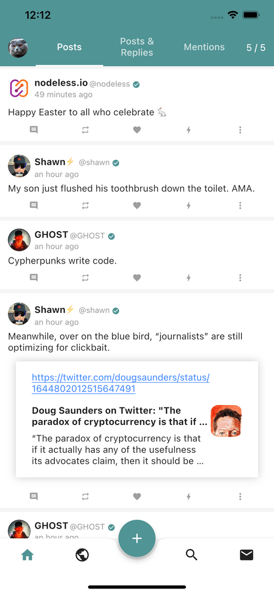
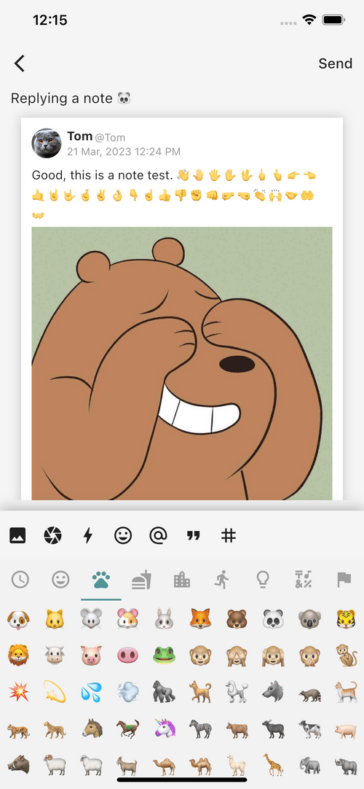
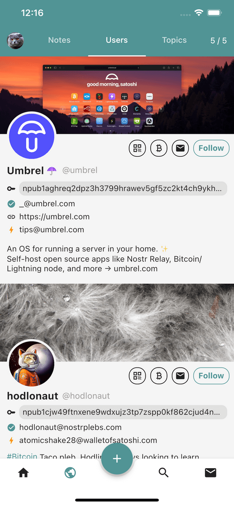
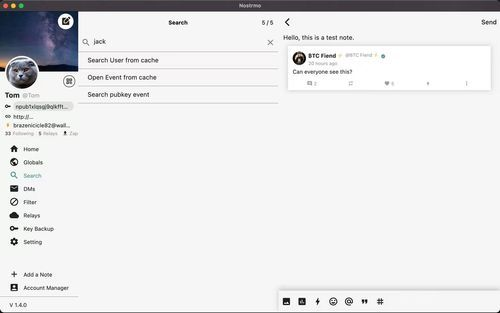

<div align="center">


# Nostrmo

A flutter nostr client for all platforms.<br/> <a href="https://github.com/haorendashu/nostrmo_faq?tab=readme-ov-file#ios" target="_blank">IOS</a>, <a href="https://github.com/haorendashu/nostrmo_faq?tab=readme-ov-file#android" target="_blank">Android</a>, <a href="https://github.com/haorendashu/nostrmo_faq?tab=readme-ov-file#macos" target="_blank">MacOS</a>, <a href="https://github.com/haorendashu/nostrmo_faq?tab=readme-ov-file#windows" target="_blank">Windows</a>, <a href="https://web.nostrmo.com/" target="_blank">Web</a> and <a href="https://github.com/haorendashu/nostrmo_faq?tab=readme-ov-file#linux" target="_blank">Linux</a>.

</div>

## Screenshots

[](./docs/screenshots/mobile1.png)
[](./docs/screenshots/mobile2.png)
[](./docs/screenshots/mobile3.png)
[](./docs/screenshots/mobile4.png)<br/>
[](./docs/screenshots/pc1.jpeg)
[](./docs/screenshots/pc2.jpeg)
[](./docs/screenshots/pc3.jpeg)

## Features

- [x] NIP-01 (Basic protocol flow description)
- [x] NIP-02 (Follow List)
- [x] NIP-03 (OpenTimestamps Attestations for Events)
- [x] NIP-04 (Encrypted Direct Message](04.md) --- **unrecommended**: deprecated in favor of NIP-44)
- [x] NIP-05 (Mapping Nostr keys to DNS-based internet identifiers)
- [ ] NIP-06 (Basic key derivation from mnemonic seed phrase)
- [x] NIP-07 (`window.nostr` capability for web browsers)
- [x] NIP-08 (Handling Mentions](08.md) --- **unrecommended**: deprecated in favor of NIP-27)
- [x] NIP-09 (Event Deletion)
- [x] NIP-10 (Conventions for clients' use of `e` and `p` tags in text events)
- [x] NIP-11 (Relay Information Document)
- [ ] NIP-13 (Proof of Work)
- [x] NIP-14 (Subject tag in text events)
- [ ] NIP-15 (Nostr Marketplace (for resilient marketplaces))
- [x] NIP-18 (Reposts)
- [x] NIP-19 (bech32-encoded entities)
- [x] NIP-21 (`nostr:` URI scheme)
- [x] NIP-23 (Long-form Content)
- [ ] NIP-24 (Extra metadata fields and tags)
- [x] NIP-25 (Reactions)
- [ ] NIP-26 (Delegated Event Signing)
- [x] NIP-27 (Text Note References)
- [ ] NIP-28 (Public Chat)
- [ ] NIP-29 (Relay-based Groups)
- [x] NIP-30 (Custom Emoji)
- [ ] NIP-31 (Dealing with Unknown Events)
- [ ] NIP-32 (Labeling)
- [ ] NIP-34 (`git` stuff)
- [x] NIP-36 (Sensitive Content)
- [ ] NIP-38 (User Statuses)
- [ ] NIP-39 (External Identities in Profiles)
- [ ] NIP-40 (Expiration Timestamp)
- [x] NIP-42 (Authentication of clients to relays)
- [x] NIP-44 (Versioned Encryption)
- [ ] NIP-45 (Counting results)
- [ ] NIP-46 (Nostr Connect)
- [ ] NIP-47 (Wallet Connect)
- [ ] NIP-48 (Proxy Tags)
- [ ] NIP-49 (Private Key Encryption)
- [x] NIP-50 (Search Capability)
- [x] NIP-51 (Lists)
- [ ] NIP-52 (Calendar Events)
- [ ] NIP-53 (Live Activities)
- [ ] NIP-56 (Reporting)
- [x] NIP-57 (Lightning Zaps)
- [x] NIP-58 (Badges)
- [x] NIP-59 (Gift Wrap)
- [x] NIP-65 (Relay List Metadata)
- [x] NIP-69 (Zap Polls)
- [x] NIP-72 (Moderated Communities)
- [x] NIP-75 (Zap Goals)
- [ ] NIP-78 (Application-specific data)
- [ ] NIP-84 (Highlights)
- [ ] NIP-89 (Recommended Application Handlers)
- [ ] NIP-90 (Data Vending Machines)
- [ ] NIP-92 (Media Attachments)
- [x] NIP-94 (File Metadata)
- [x] NIP-95 (Shared File)
- [x] NIP-96 (HTTP File Storage Integration)
- [ ] NIP-98 (HTTP Auth)
- [ ] NIP-99 (Classified Listings)

## Build Script

### Android

```
-- build for appbundle
flutter build appbundle --release

-- build for apk
flutter build apk --release
```

### IOS and MacOS

build by XCode

### Windows

```
flutter build windows --release
```

### Web

```
flutter build web --release --web-renderer canvaskit
```

### Linux

Linux depend on ```libsqlite``` and ```libmpv```, you can try to run this script to install before it run: 

```
sudo apt-get -y install libsqlite3-0 libsqlite3-dev libmpv-dev mpv
```

```
flutter build linux --release
```

## FAQ

You can find more info from this [FAQ](https://github.com/haorendashu/nostrmo_faq)
